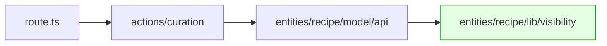

어제까지 잘 되던 큐레이션 생성 API가 갑자기 500을 뱉었어요. 라우트는 컴파일은 되는데 응답이 안 와요. 추적해보니 `entities/recipe`의 `index.ts` 한 줄이 원인이었어요. self-barrel import 한 줄이 어떻게 Turbopack을 무너뜨렸는지, 그리고 같은 함정에 다시 빠지지 않으려고 무엇을 했는지 이야기해볼게요.

결과부터 말하면 fix는 한 줄이에요. `@/entities/recipe`를 `@/entities/recipe/lib/visibility`로 바꾸는 것. 그 한 줄까지 가는 데 11번의 dev 재시작이 필요했고, 그 과정에서 같은 패턴이 프로젝트 안에 5곳 더 잠복해 있다는 걸 알게 됐어요.

## 왜 FSD에서 배럴을 쓰게 됐을까

Feature-Sliced Design을 쓰는 프로젝트라면 각 슬라이스(예: `entities/recipe`, `features/recipe-create`)가 자기 디렉터리 끝에 `index.ts`라는 배럴 파일을 두는 패턴에 익숙할 거예요. 외부에서는 슬라이스의 공개 API만 알면 되니까 import 경로가 깔끔해지고, 내부 구조를 리팩토링해도 외부의 import 경로가 그대로 유지되거든요.

저희 프로젝트도 같은 패턴이에요.

```ts
// src/entities/recipe/index.ts
export * from "./model/api";
export { ensureSource, isPrivateRecipe } from "./lib/visibility";
export type { Recipe, RecipeStep } from "./model/types";
```

페이지나 다른 슬라이스에서는 그냥 `@/entities/recipe`만 쓰면 다 가져올 수 있어요. 깔끔하고, 팀이 받아들인 표준이에요.

## 문제 발생 — 갑자기 500

어느 날 admin 페이지의 큐레이션 생성 기능이 500 응답을 받기 시작했어요. dev 콘솔에 남은 건 이것뿐이었어요.

```
thread 'tokio-runtime-worker' panicked at crates\next-api\src\dynamic_imports.rs:70:26:
called `Option::unwrap()` on a `None` value
note: run with `RUST_BACKTRACE=1` environment variable to display a backtrace
 ✓ Compiled /api/admin/curation/generate in 686ms
 POST /api/admin/curation/generate 500 in 1915ms
```

이상한 건, 라우트는 `✓ Compiled`라고 나오는데 응답은 500이라는 점이에요. 라우트 핸들러에 `console.error`를 박아둬도 아무것도 안 찍혀요. JS가 실행되기 전 단계에서 뭔가 폭발한 거예요.

더 이상한 건 같은 프로젝트의 다른 API 라우트는 모두 멀쩡하다는 점. `/api/recipes`, `/api/search` 다 정상 동작. 오직 이 라우트 하나만 죽었어요.

## 첫 가설 — Turbopack 버그?

`dynamic_imports.rs:70`이라는 위치, `Option::unwrap()` on `None`이라는 Rust panic 시그니처. 누가 봐도 Turbopack 내부 버그처럼 보였어요. 실제로 Next.js 깃헙 이슈를 검색해보면 비슷한 panic 리포트가 여러 건 있고, 대부분 "최신 버전에서 fix됐다"는 답글이 달려 있어요. 우리 프로젝트는 Next.js 15.3.8이고, 15.5쯤으로 올리면 풀린다는 보고도 있었어요.

여기서 갈림길이었어요. **버전업으로 회피할까, 아니면 더 파볼까.**

버전업의 비용을 빠르게 가늠해봤어요. App Router 동작 변화, React Compiler 호환성, server actions 시그니처. 잘못 건드리면 다른 곳이 깨질 수 있고, 어쨌든 "왜 우리 프로젝트의 이 라우트만" 터지는지에 대한 답은 안 줘요. 다른 라우트는 같은 Turbopack에서 멀쩡한데 이 라우트만 죽는다면, 우리 코드 어딘가에 트리거가 있다는 뜻이거든요. 같은 panic이 GitHub에 보고됐다는 사실은 우리 코드에 트리거가 있을 가능성을 부정하지 않아요.

파보기로 했어요.

## 의심을 좁히는 — 이진 탐색

먼저 `route.ts`를 빈 핸들러로 줄여봤어요.

```ts
import { type NextRequest, NextResponse } from "next/server";

export async function POST(_req: NextRequest) {
  return NextResponse.json({ diag: "empty" });
}
```

panic이 사라지고 200 응답이 돌아왔어요. 그러면 **import 그래프 어딘가가 트리거**라는 게 확정돼요.

이제 한 줄씩 다시 추가하면서 어디서 터지는지 찾았어요. 원래 라우트의 추가 import는 세 줄이에요.

```ts
import { CurationError, type GenerateCurationInput } from "@/entities/curation";
import { generateCuration } from "@/app/actions/curation";
import { assertAdminApi } from "@/shared/lib/admin-guard";
```

가장 큰 그래프를 가진 `@/app/actions/curation`부터 다시 붙여봤어요. **panic 부활.** 이 그래프 안에 트리거가 있어요. 그 안의 import는 많아요. ai-sdk, zod, entities, shared, 그리고 `app/admin/curation-test/lib/*` 9개.

각각 단독으로 떼서 시험해봤어요.

- `@ai-sdk/openai` + `ai`만: 통과
- `@/app/admin/curation-test/lib/slugify`만: 통과
- `"use server"` + `@/shared/lib/admin-guard`: 통과
- `"use server"` + `@/entities/recipe/model/api`: **panic.**

`getRecipe` 한 줄을 추가하는 순간 죽었어요. 그 모듈을 열어봤어요.

```ts
// src/entities/recipe/model/api.ts
import { ensureSource } from "@/entities/recipe";  // ← 이 한 줄
import { END_POINTS } from "@/shared/config/constants/api";
// ...

export const getRecipe = async (id: string) => {
  const r = await api.get<Recipe>(END_POINTS.RECIPE(id));
  return r;
};
```

`api.ts`가 `@/entities/recipe`를 import해요. 그게 자기가 속한 슬라이스의 배럴이에요. 그리고 그 배럴은:

```ts
export * from "./model/api";  // ← api.ts 자기 자신을 re-export
```

자기 자신으로 돌아오는 cycle이 있었어요.

## 진짜 원인 확정

직접 경로로 한 줄 바꿔봤어요.

```diff
- import { ensureSource } from "@/entities/recipe";
+ import { ensureSource } from "@/entities/recipe/lib/visibility";
```

panic이 사라졌어요. 11단계 isolation 끝에 한 줄 변경으로 끝났어요.

## 그래프로 보면

문제 그래프는 이렇게 생겼어요.

```mermaid
flowchart LR
    route["route.ts"] --> actions["actions/curation"]
    actions --> api["entities/recipe/model/api"]
    api --> barrel["@/entities/recipe (barrel)"]
    barrel -. re-exports ./model/api .-> api

    style barrel fill:#ffe4e4,stroke:#c00
    style api fill:#ffe4e4,stroke:#c00
```

`api.ts`가 자기 슬라이스의 배럴을 import하고, 배럴은 `api.ts`를 다시 export하면서 self-cycle 형성. fix 후 그래프는 이래요.



자기 자신으로 돌아오는 길이 없어요.

## 왜 찾기가 어려웠나

세 가지가 겹쳤어요.

첫째, **에러 메시지가 우리 코드를 가리키지 않아요.** `crates/next-api/src/dynamic_imports.rs:70`은 Next.js 내부 Rust 코드 경로예요. 우리 프로젝트 어디가 잘못됐는지 한 글자도 안 알려줘요.

둘째, **`console.error`도 안 찍혀요.** Turbopack 워커가 라우트 모듈을 빌드하다 죽었기 때문에, 우리가 짠 JS 코드는 한 줄도 실행되지 않았어요. catch도, log도, sentry breadcrumb도 다 무의미해요.

셋째, **잠복형이에요.** cycle은 이미 며칠 전 커밋에서 만들어져 있었어요. 다만 single generate는 server action 직접 호출이라 라우트가 한 번도 컴파일된 적이 없었고, batch도 dev에서 안 눌러봤어요. 오늘 처음으로 라우트가 hit되면서 처음으로 컴파일이 시도됐고, 거기서 처음으로 panic이 났어요. "어제까지 잘 됐는데"라는 감각이 강해질수록 디버깅이 더 헤매는 구조였어요.

더 좋은 방법이 있었을까. 돌아보면 `RUST_BACKTRACE=1`로 dev를 띄웠으면 어느 Turbopack 내부 단계에서 unwrap이 일어났는지 더 빨리 봤을 수도 있어요. 또는 `eslint-plugin-import`의 `no-cycle` 규칙을 켜뒀으면 커밋 시점에 잡혔을 거예요. 다만 `no-cycle`은 전체 import 그래프를 돌아서 느린 걸로 유명해서, 그동안 켜는 걸 미뤘던 결정에 비용이 청구된 셈이에요.

## 다른 곳도 위험했다

같은 패턴이 프로젝트 안에 더 있는지 궁금해서 grep 스크립트를 짰어요.

```js
// scripts/find-self-barrel.mjs
const layers = ["entities", "features", "widgets"];
for (const layer of layers) {
  for (const slice of readdirSync(`src/${layer}`)) {
    const barrel = `@/${layer}/${slice}`;
    walk(`src/${layer}/${slice}`, (file) => {
      // file 안에 `from "${barrel}"` 가 정확 매칭으로 있는지
    });
  }
}
```

결과는 **5개 파일**. 이미 fix한 `entities/recipe/model/api.ts`까지 합치면 6곳이었어요.

| 파일 | 노출 그래프 |
|---|---|
| `entities/recipe/model/api.ts` | route-handler + server-action ← 터진 곳 |
| `entities/recipe/ui/RecipeStepList.tsx` | page graph |
| `features/comment-like/model/hooks.ts` | page graph |
| `features/comment-like/ui/CommentLikeButton.tsx` | page graph |
| `features/ingredient-add-fridge/ui/IngredientSearchDrawer.tsx` | page graph |
| `features/recipe-create/ui/RecipeFormLayout.tsx` | page graph |

cycle은 6개였는데 터진 건 1개. 나머지 5개는 잠재 폭탄이었어요. 누가 그 모듈 중 하나를 server-only context (route handler, server action, instrumentation 등)에 끌어들이는 순간 같은 panic이 재발해요.

## 왜 페이지에서는 동작했고, 라우터에서 터졌을까

Next.js는 한 가지 모듈 그래프만 빌드하지 않아요. 페이지용, 라우트 핸들러용, server-actions registry용, middleware용 — 그래프를 여러 개 만들고 각각 다른 분석 패스를 거쳐요. cycle은 모든 그래프에서 형성되지만, 페이지 그래프는 cycle을 우회할 수 있는 다른 경로가 많아서 Turbopack이 별 문제없이 통과시켜요.

문제는 route-handler 그래프와 server-actions registry 그래프가 `dynamic_imports.rs`라는 더 엄격한 분석기를 추가로 통과한다는 점이에요. 그 안에서 module map lookup이 None을 받았는데 코드가 그걸 `.unwrap()`해버리면 워커 스레드가 panic. Next.js는 모듈을 못 만들고 500을 던지고요.

같은 cycle을 가진 같은 파일이라도 어느 그래프에 들어가느냐에 따라 운명이 갈리는 셈이에요. 그래서 1개만 터졌고 5개는 조용히 잠복할 수 있었어요.

## 재발 방지 — 세 겹의 가드

cycle을 사람 눈으로 찾는 건 한계가 있어요. 자동화 가드를 깔았어요.

**1) ESLint 규칙으로 막기**

`no-restricted-imports`로 슬라이스마다 자기 배럴 import를 금지했어요. 슬라이스 이름을 매번 하드코딩하면 새 슬라이스 추가될 때마다 룰 수정해야 하니까, `fs.readdirSync`로 동적으로 슬라이스 목록을 읽었어요.

```js
// eslint.config.mjs
const selfBarrelGuards = ["entities", "features", "widgets"].flatMap((layer) =>
  collectSlices(layer).map((slice) => ({
    files: [`src/${layer}/${slice}/**/*.{ts,tsx}`],
    rules: {
      "no-restricted-imports": ["error", {
        patterns: [{
          regex: `^@/${layer}/${slice}$`,
          message: `Self-barrel import. Use direct path like '@/${layer}/${slice}/model/foo'`,
        }],
      }],
    },
  })),
);
```

여기서 한 가지 함정이 있었어요. `patterns[].group`을 처음 썼더니 minimatch 매칭이라 deep path까지 다 걸려요. `@/features/recipe-create`를 group에 넣으면 `@/features/recipe-create/ui/Button` 같은 정상 deep path도 빨갛게 표시됐어요. `regex`로 바꿔서 `^@/${layer}/${slice}$` 정확 매칭만 잡게 하니 의도대로 동작했어요. deep path는 통과, 배럴 정확 매칭만 차단.

**2) 안전망 grep 스크립트**

ESLint 없이도 돌릴 수 있는 plain Node 스크립트를 `scripts/find-self-barrel.mjs`에 두고, `npm run lint:self-barrel`로 호출할 수 있게 했어요. CI 파이프라인이나 pre-push hook에 한 줄로 박을 수 있어요.

**3) 팀이 공유할 룰**

마지막으로, "왜 그러면 안 되는지"가 본문에 안 남아 있으면 또 누가 무심코 같은 패턴을 들고 와요. 프로젝트의 `.claude/skills/` 디렉터리에 lesson 한 파일로 박아뒀어요. 누군가가 같은 panic 시그니처를 보면 그 룰이 자동으로 끌려나와요.

## 느낀점

배럴은 **밖에서 들어오는 입구**예요. 슬라이스 외부에서는 깔끔하게 한 줄로 들고 갈 수 있게 해주는 인터페이스. 슬라이스 내부에서는 직접 경로로 형제 모듈에 접근하는 게 맞아요. 입구를 통해 자기 동네를 한 바퀴 도는 모양은, 사람 눈에는 자연스러워 보여도 모듈 그래프에는 cycle을 그리는 일이거든요.

디버깅에 11단계를 쓴 건 부끄럽기도 한데, 잘 짜인 isolation 절차가 없었으면 비슷한 panic을 만났을 때 또 비슷한 시간이 들어갔을 거예요. 빈 핸들러로 줄이기 → 한 줄씩 다시 붙이기 → cycle 의심하기. 이 순서만 다음에 5분 안에 도달할 수 있다면 이번 시간이 아깝지는 않아요.

다음에 잡을 건 `import/no-cycle`을 켜는 일이에요. 빌드 비용이 들어도 cycle이 코드 어딘가에 또 숨어 있을 가능성이 있고, 이번에 다섯 개나 찾은 걸 보면 그건 가능성이 아니라 거의 확실한 일이거든요.
